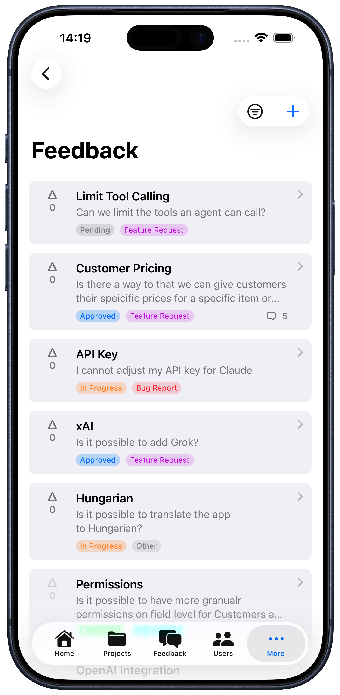
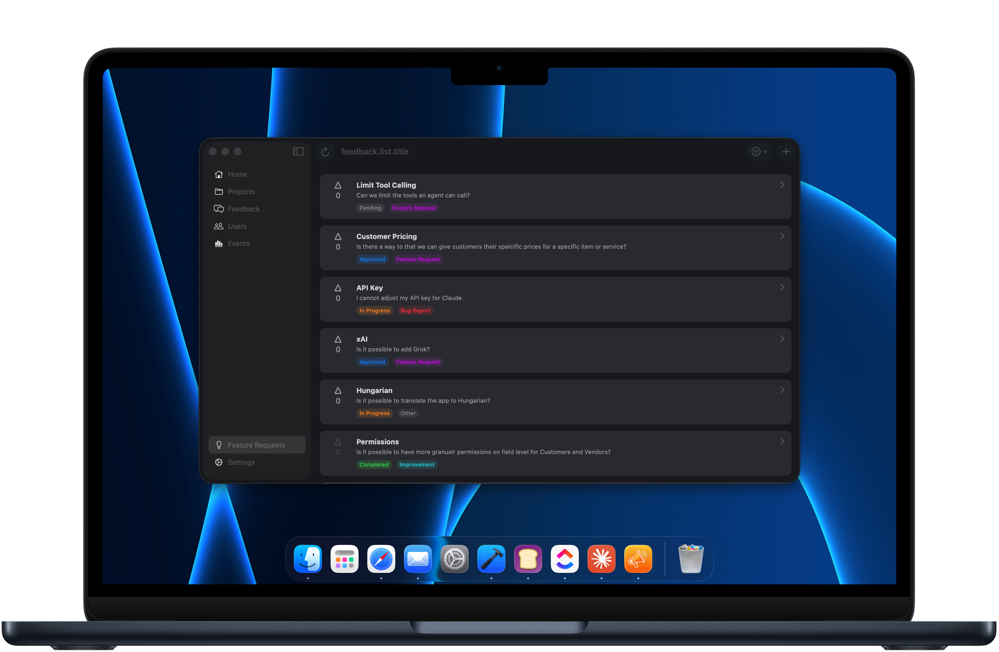
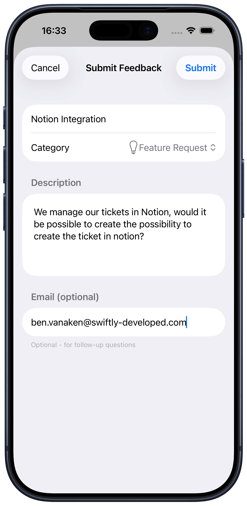
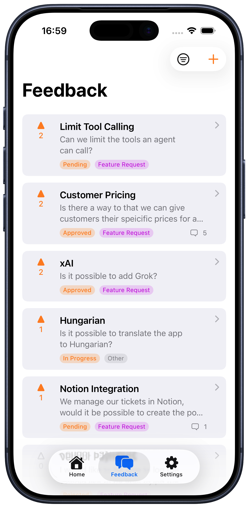
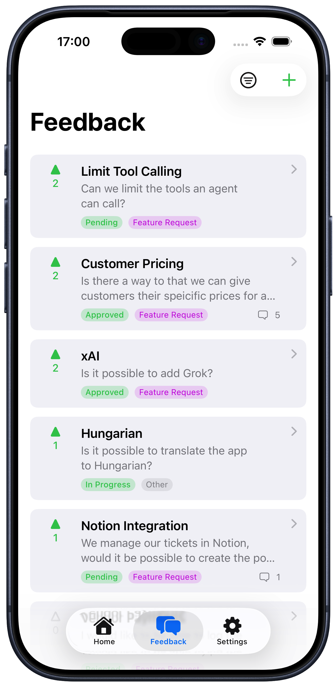
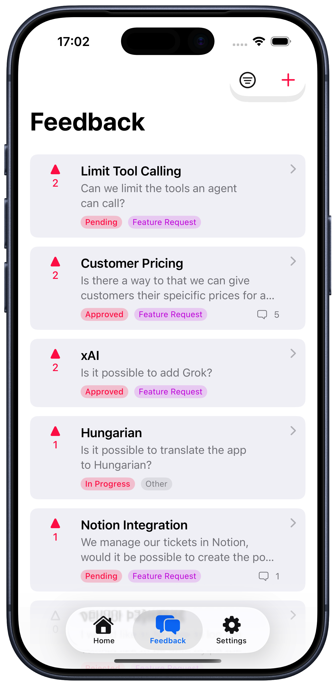
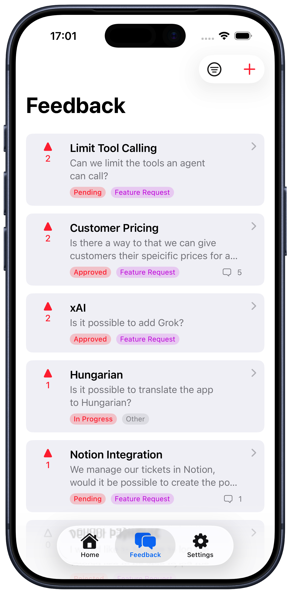
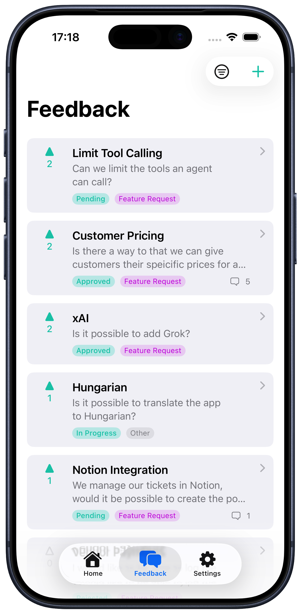
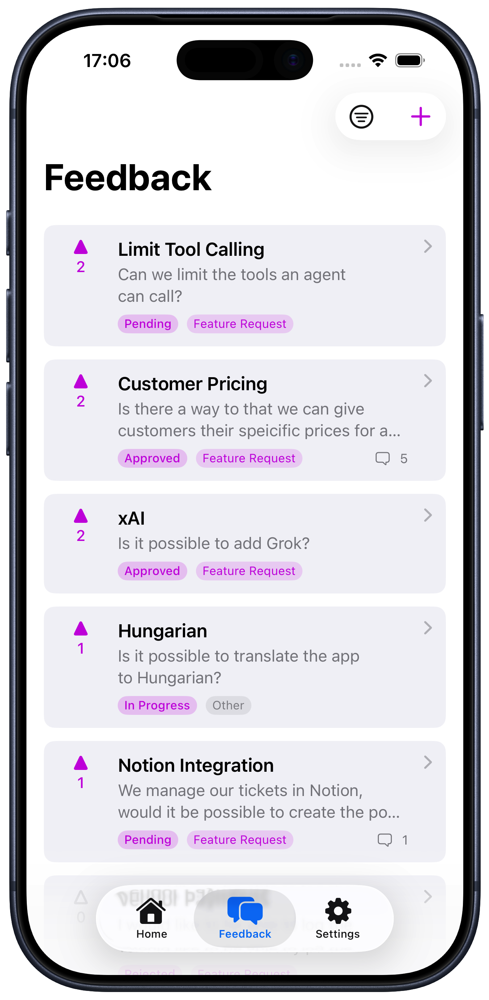
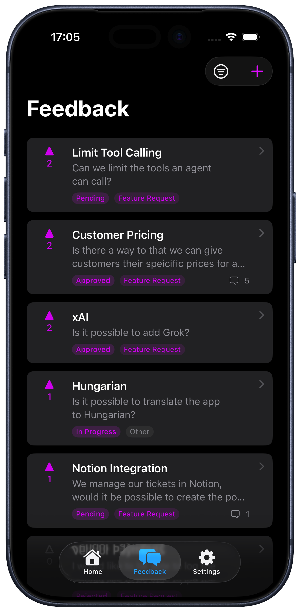

#  FeedbackKit

In-app feedback collection for iOS, macOS, and visionOS.


FeedbackKit is a Swift SDK that lets you collect, manage, and respond to user feedback directly within your app. Users can submit feature requests, report bugs, vote on ideas, and see what's being worked on—all without leaving your app.

## Features

- **Ready-to-use SwiftUI views** — Drop-in feedback list, submission form, and detail views
- **Voting system** — Let users upvote feedback to surface popular requests
- **Comments** — Two-way communication between you and your users
- **Status tracking** — Show users the progress of their feedback (pending → approved → in progress → completed)
- **Categories** — Organize feedback by type: feature requests, bug reports, improvements
- **Theming** — Customize colors to match your app's design
- **Dark mode** — Full support for light and dark appearances
- **Multi-platform** — Native support for iOS, macOS, and visionOS
- **Event tracking** — Built-in analytics for user engagement
- **MRR tracking** — Associate feedback with customer revenue

## Requirements

- iOS 26.0+ / macOS 26.0+ / visionOS 26.0+
- Swift 6.2+
- Xcode 26.0+

## Installation

### Swift Package Manager

Add FeedbackKit to your project using Xcode:

1. Go to **File → Add Package Dependencies...**
2. Enter the repository URL:
   ```
   https://github.com/Swiftly-Developed/SwiftlyFeedbackKit
   ```
3. Select the version and click **Add Package**

Or add it to your `Package.swift`:

```swift
dependencies: [
    .package(url: "https://github.com/Swiftly-Developed/SwiftlyFeedbackKit", from: "1.0.0")
]
```

## Quick Start

Get up and running in 3 steps:

### 1. Import and Configure

```swift
import SwiftlyFeedbackKit

@main
struct MyApp: App {
    init() {
        // Auto-detects environment (localhost/TestFlight/production)
        SwiftlyFeedback.configureAuto(with: "your_api_key")
    }

    var body: some Scene {
        WindowGroup {
            ContentView()
        }
    }
}
```

### 2. Present the Feedback List

```swift
import SwiftlyFeedbackKit

struct ContentView: View {
    @State private var showFeedback = false

    var body: some View {
        Button("Send Feedback") {
            showFeedback = true
        }
        .sheet(isPresented: $showFeedback) {
            FeedbackListView()
        }
    }
}
```

### 3. That's it!

Your users can now browse existing feedback, submit new ideas, and vote on what matters most.



## Configuration

### API Key Setup

Get your API key from the [FeedbackKit Admin app](https://feedbackkit.app):

1. Create or select a project
2. Go to **Project Settings → API Key**
3. Copy the key (starts with `sf_`)

### Configuration Methods

```swift
// Recommended: Auto-detects the right server based on build type
// - DEBUG: localhost:8080
// - TestFlight: TestFlight server
// - App Store: Production server
SwiftlyFeedback.configureAuto(with: "sf_your_api_key")

// Explicit localhost (for development)
SwiftlyFeedback.configure(with: "sf_your_api_key")

// Custom server URL
SwiftlyFeedback.configure(
    with: "sf_your_api_key",
    baseURL: URL(string: "https://your-server.com/api/v1")!
)
```

## Views

FeedbackKit provides three main SwiftUI views that handle all the UI and API interactions for you.

### FeedbackListView

Displays all feedback with sorting and filtering options.

```swift
// Basic usage
FeedbackListView()

// With custom instance
FeedbackListView(swiftlyFeedback: customInstance)
```

**Features:**
- Sort by votes, newest, or oldest
- Filter by status (pending, approved, in progress, etc.)
- Pull-to-refresh on iOS
- Add feedback button (configurable)
- Empty state with call-to-action



### SubmitFeedbackView

A form for users to submit new feedback.

```swift
// Basic usage
SubmitFeedbackView()

// With dismiss callback
SubmitFeedbackView {
    // Called when the view is dismissed
    print("Feedback submitted or cancelled")
}
```

**Features:**
- Title and description fields
- Category picker (Feature Request, Bug Report, Improvement, Other)
- Optional email field
- Platform-optimized layouts (form on iOS, grid on macOS)
- Loading state during submission
- Keyboard shortcut on macOS (⌘Return to submit)

<table>
<tr>
<td></td>
<td></td>
</tr>
</table>

### FeedbackDetailView

Shows detailed information about a single feedback item.

```swift
FeedbackDetailView(feedback: selectedFeedback)
```

**Features:**
- Full title and description
- Status and category badges
- Vote button with count
- Comments section
- Submission date

## Customization

### Feature Toggles

Control which UI elements are visible:

```swift
// Voting
SwiftlyFeedback.config.allowUndoVote = true          // Allow removing votes
SwiftlyFeedback.config.showVoteCount = true          // Show vote counts

// Badges
SwiftlyFeedback.config.showStatusBadge = true        // Show status badges
SwiftlyFeedback.config.showCategoryBadge = true      // Show category badges

// Form fields
SwiftlyFeedback.config.showEmailField = true         // Show email in submit form

// Comments
SwiftlyFeedback.config.showCommentSection = true     // Show comments in detail view

// List behavior
SwiftlyFeedback.config.expandDescriptionInList = false  // Expand descriptions in list

// Buttons
SwiftlyFeedback.config.buttons.addButton.display = true
SwiftlyFeedback.config.buttons.addButton.bottomPadding = 16
SwiftlyFeedback.config.buttons.segmentedControl.display = true
```

### Disable Feedback Submission

Useful for paywalls or read-only modes:

```swift
SwiftlyFeedback.config.allowFeedbackSubmission = false
SwiftlyFeedback.config.feedbackSubmissionDisabledMessage = "Upgrade to Pro to submit feedback"
```

### Vote Notifications

Let users receive email notifications when feedback they voted on changes status:

```swift
// Pre-set user email (votes use this automatically, no dialog shown)
SwiftlyFeedback.config.userEmail = "user@example.com"

// Show email dialog when voting (only shown if userEmail is nil)
SwiftlyFeedback.config.showVoteEmailField = true  // default: true

// Default opt-in state for the "notify me" toggle
SwiftlyFeedback.config.voteNotificationDefaultOptIn = false  // default: false

// Sync email back to your app when user enters it via vote dialog
SwiftlyFeedback.config.onUserEmailChanged = { email in
    UserDefaults.standard.set(email ?? "", forKey: "userEmail")
}
```

**Behavior:**
- If `userEmail` is set: Votes automatically use that email, no dialog shown
- If `userEmail` is nil and `showVoteEmailField` is true: Users see a dialog to optionally enter email
- If `userEmail` is nil and `showVoteEmailField` is false: Votes submitted without email

Users who opt-in receive emails when feedback status changes (approved, in progress, completed, etc.) with a one-click unsubscribe link.

### Theming

Customize colors to match your app:

```swift
// Primary color (buttons, highlights)
SwiftlyFeedback.theme.primaryColor = .color(.blue)

// Adaptive colors for dark mode
SwiftlyFeedback.theme.primaryColor = .adaptive(
    light: .blue,
    dark: .cyan
)

// Use system accent color
SwiftlyFeedback.theme.primaryColor = .default
```

#### Status Colors

Customize the color for each feedback status:

```swift
SwiftlyFeedback.theme.statusColors.pending = .gray
SwiftlyFeedback.theme.statusColors.approved = .blue
SwiftlyFeedback.theme.statusColors.inProgress = .orange
SwiftlyFeedback.theme.statusColors.testflight = .cyan
SwiftlyFeedback.theme.statusColors.completed = .green
SwiftlyFeedback.theme.statusColors.rejected = .red
```

#### Category Colors

Customize the color for each feedback category:

```swift
SwiftlyFeedback.theme.categoryColors.featureRequest = .purple
SwiftlyFeedback.theme.categoryColors.bugReport = .red
SwiftlyFeedback.theme.categoryColors.improvement = .teal
SwiftlyFeedback.theme.categoryColors.other = .gray
```

#### Theme Examples

<table>
<tr>
<td></td>
<td></td>
<td></td>
</tr>
<tr>
<td></td>
<td></td>
<td></td>
</tr>
</table>

### Dark Mode

FeedbackKit automatically adapts to the system appearance. Use adaptive colors for custom theming:

```swift
SwiftlyFeedback.theme.primaryColor = .adaptive(
    light: .blue,
    dark: .cyan
)
```

<table>
<tr>
<td></td>
<td></td>
</tr>
</table>

## Direct API Access

For custom implementations, access the API directly:

### Fetching Feedback

```swift
// Get all feedback
let allFeedback = try await SwiftlyFeedback.shared?.getFeedback()

// Filter by status
let pending = try await SwiftlyFeedback.shared?.getFeedback(status: .pending)

// Filter by category
let bugs = try await SwiftlyFeedback.shared?.getFeedback(category: .bugReport)

// Combine filters
let pendingBugs = try await SwiftlyFeedback.shared?.getFeedback(
    status: .pending,
    category: .bugReport
)

// Get single feedback by ID
let feedback = try await SwiftlyFeedback.shared?.getFeedback(id: feedbackId)
```

### Submitting Feedback

```swift
let feedback = try await SwiftlyFeedback.shared?.submitFeedback(
    title: "Dark mode support",
    description: "It would be great to have a dark mode option...",
    category: .featureRequest,
    email: "user@example.com"  // Optional
)
```

### Voting

```swift
// Vote for feedback
let result = try await SwiftlyFeedback.shared?.vote(for: feedbackId)
print("New vote count: \(result.voteCount)")

// Vote with email for status notifications
let result = try await SwiftlyFeedback.shared?.vote(
    for: feedbackId,
    email: "user@example.com",
    notifyStatusChange: true
)

// Remove vote (if allowUndoVote is enabled)
let result = try await SwiftlyFeedback.shared?.unvote(for: feedbackId)
```

### Comments

```swift
// Get comments for feedback
let comments = try await SwiftlyFeedback.shared?.getComments(for: feedbackId)

// Add a comment
let comment = try await SwiftlyFeedback.shared?.addComment(
    to: feedbackId,
    content: "Thanks for the suggestion!"
)
```

## User Identification

FeedbackKit automatically generates and persists a unique user ID in the Keychain. This ID survives app reinstalls and is used to track votes and associate feedback.

### Custom User ID

Associate feedback with your own user system:

```swift
// Set a custom user ID (e.g., after login)
SwiftlyFeedback.updateUser(customID: "user_12345")
```

### MRR Tracking

Track Monthly Recurring Revenue to prioritize feedback from paying customers:

```swift
// Set user's subscription value
SwiftlyFeedback.updateUser(payment: .monthly(9.99))
SwiftlyFeedback.updateUser(payment: .yearly(99.99))
SwiftlyFeedback.updateUser(payment: .weekly(2.31))
SwiftlyFeedback.updateUser(payment: .quarterly(29.97))

// Clear on subscription cancellation
SwiftlyFeedback.clearUserPayment()
```

MRR data appears in the Admin app, allowing you to sort and filter feedback by customer value.

## Event Tracking

FeedbackKit includes built-in analytics to track user engagement.

### Automatic Tracking

By default, view events are tracked automatically when users open SDK screens:

- `feedback_list` — When FeedbackListView appears
- `feedback_detail` — When FeedbackDetailView appears
- `submit_feedback` — When SubmitFeedbackView appears

Disable automatic tracking:

```swift
SwiftlyFeedback.config.enableAutomaticViewTracking = false
```

### Custom Events

Track custom events in your app:

```swift
// Simple event
SwiftlyFeedback.view("onboarding_completed")

// Event with properties
SwiftlyFeedback.view("purchase_completed", properties: [
    "product_id": "pro_monthly",
    "price": "9.99"
])

// Predefined SDK views
SwiftlyFeedback.view(.feedbackList)
SwiftlyFeedback.view(.feedbackDetail)
SwiftlyFeedback.view(.submitFeedback)
```

## Localization

FeedbackKit uses String Catalogs for localization. All user-facing strings can be customized or translated.

To override SDK strings in your app:

1. Create a `Localizable.xcstrings` file in your project
2. Add the SDK's string keys with your custom translations
3. The SDK will use your translations automatically

## Error Handling

FeedbackKit provides typed errors for handling failures:

```swift
do {
    let feedback = try await SwiftlyFeedback.shared?.submitFeedback(
        title: "My idea",
        description: "Details...",
        category: .featureRequest
    )
} catch let error as SwiftlyFeedbackError {
    switch error {
    case .invalidApiKey:
        print("Check your API key")
    case .feedbackLimitReached(let message):
        print("Limit reached: \(message ?? "Upgrade your plan")")
    case .networkError(let underlying):
        print("Network issue: \(underlying)")
    case .unauthorized:
        print("Authentication failed")
    case .notFound:
        print("Feedback not found")
    default:
        print("Error: \(error.localizedDescription)")
    }
}
```

### Invalid API Key

When an invalid API key is detected, the SDK automatically shows an error state in views. No feedback data is displayed, and submission is disabled.

## Logging

FeedbackKit logs API requests and responses using OSLog for debugging:

```swift
// Disable logging in production
SwiftlyFeedback.config.loggingEnabled = false
```

Logs appear in Console.app under the subsystem `com.swiftlyfeedback.sdk`.

## Example App

Check out the [SwiftlyFeedbackDemoApp](../SwiftlyFeedbackDemoApp) for a complete integration example showing:

- Basic setup and configuration
- Presenting feedback views
- Custom theming
- Event tracking
- User identification

## Feedback Statuses

| Status | Description | Can Vote |
|--------|-------------|----------|
| Pending | New feedback, awaiting review | Yes |
| Approved | Accepted for consideration | Yes |
| In Progress | Currently being worked on | Yes |
| TestFlight | Available in beta | Yes |
| Completed | Shipped and available | No |
| Rejected | Won't be implemented | No |

## Feedback Categories

| Category | Icon | Use Case |
|----------|------|----------|
| Feature Request | 💡 | New functionality ideas |
| Bug Report | 🐛 | Issues and problems |
| Improvement | ⬆️ | Enhancements to existing features |
| Other | ⋯ | General feedback |

## Platform Differences

### iOS
- Form-based submit view with sections
- Pull-to-refresh in feedback list
- Sheet presentation recommended

### macOS
- Grid-based submit view
- Minimum window size enforced (400×350)
- ⌘Return shortcut to submit
- Window or popover presentation

### visionOS
- Adapted for spatial computing
- Supports all standard interactions

## Admin App

Manage your feedback from the [FeedbackKit Admin app](https://feedbackkit.app):

- Review and respond to feedback
- Update statuses
- View analytics and MRR data
- Configure integrations (Slack, GitHub, Linear, Notion, etc.)
- Manage team members

## Support

- **Documentation:** [feedbackkit.app/docs](https://feedbackkit.app/docs)
- **Issues:** [GitHub Issues](https://github.com/Swiftly-Developed/SwiftlyFeedbackKit/issues)
- **Email:** support@feedbackkit.app

## License

FeedbackKit is available under the MIT license. See the [LICENSE](LICENSE) file for details.
